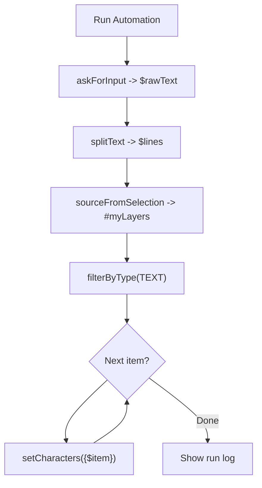
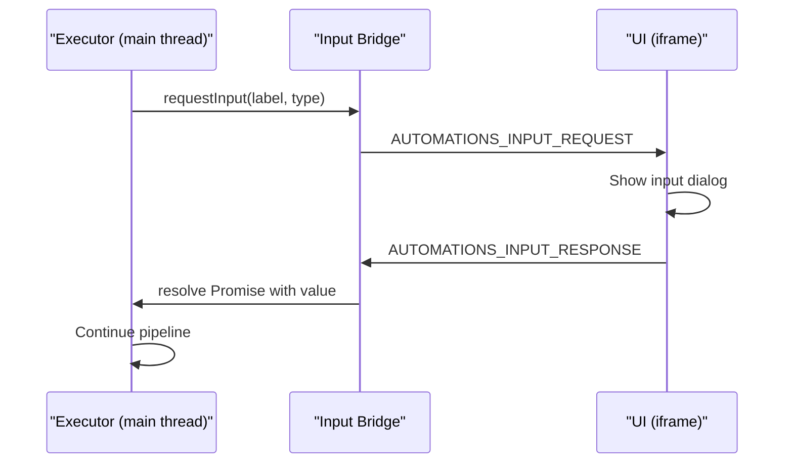

# Automations Tool -- Sequential Workflow Builder

## Concept

A tool where users build named automations by adding steps from a menu of actions. Steps execute sequentially, with an `AutomationContext` (nodes, pipeline variables, log) flowing from one step to the next. **Every action produces an output that persists and can be reused by any later action** -- like Apple Shortcuts' Magic Variables. Automations are saved to `figma.clientStorage` and can be reused, exported, and imported.

## Design Principle: Figma-First

**Primitive actions map directly to Figma API operations.** Param keys use Figma's property names. Action labels use human-friendly terms. This ensures the automation model mirrors Figma's data structure -- no inventing abstractions when Figma already has the concept.

**Two-tier action model:**

- **Tier 1: Primitives** -- thin wrappers around single Figma API operations. One action = one property or method. Example: `setCharacters` wraps `node.characters = "..."`, `setLayoutMode` wraps `node.layoutMode = "VERTICAL"`.
- **Tier 2: Compounds** (Phase 4) -- convenience actions that combine multiple primitives into one step. Example: "Resize to parent" = goToParent + readProperty + restoreNodes + resize in one action. Saved automations themselves can serve as compound actions (call one automation from another).

**Naming convention:**


| actionType (Figma-aligned) | Label (human-friendly) | Figma API           |
| -------------------------- | ---------------------- | ------------------- |
| `setCharacters`            | Set text content       | `node.characters`   |
| `setLayoutMode`            | Set auto layout        | `node.layoutMode`   |
| `setOpacity`               | Set opacity            | `node.opacity`      |
| `resize`                   | Resize                 | `node.resize(w, h)` |
| `setFillColor`             | Set fill color         | `node.fills`        |
| `filterByType`             | Filter by type         | `node.type`         |
| `expandToChildren`         | Expand to children     | `node.children`     |


## Architecture

Follows the existing tool pattern:

- Entry: `src/automations-tool/run-automation.ts`
- Main thread: `src/app/tools/automations/main-thread.ts`
- UI view: `src/app/views/automations-tool/AutomationsToolView.tsx`
- Registered via `run.ts`, routed via `ui.tsx`, messages in `messages.ts`

### Data Model

```typescript
interface Automation {
  id: string
  name: string
  steps: AutomationStep[]
  createdAt: number
  updatedAt: number
}

interface AutomationStep {
  id: string
  actionType: ActionType
  params: Record<string, unknown>
  enabled: boolean
  children?: AutomationStep[]   // for repeatWithEach body
  outputName?: string           // if set, action's result is saved as a named variable/snapshot
}
```

Stored as JSON array in `figma.clientStorage` under key `"automations_v1"`.

### AutomationContext

```typescript
interface AutomationContext {
  nodes: SceneNode[]
  variables: Variable[]
  styles: BaseStyle[]
  log: StepLogEntry[]
  pipelineVars: Record<string, PipelineValue | PipelineListValue>
  savedNodeSets: Record<string, SceneNode[]>   // named node snapshots
}

type PipelineValue = string | number | boolean
type PipelineListValue = PipelineValue[]
```

Actions receive context + params, return modified context. Token resolver supports `{name}`, `{type}`, `{index}`, `{count}`, `{$var}`. Property registry provides 17 node properties.

### Action Output Model (Apple Shortcuts-style)

Every action produces an output. If the step has `outputName` set, the executor automatically saves the result after the action runs:

- **Data actions** (askForInput, splitText, count, setPipelineVariable): output is the produced value -> saved to `pipelineVars[outputName]`
- **Node-producing actions** (source, filter, navigate, transform): output is the resulting working set -> saved to `savedNodeSets[outputName]`

Saved node sets can be restored later via `restoreNodes` action, or their properties accessed via `{#snapshotName.property}` tokens.

For data actions like `askForInput`, `outputName` is required (it replaces the old `variableName` param). For node actions, `outputName` is optional -- only set it when you need to reference this step's output later.

Token syntax for saved node sets:

- `{#parents.width}` -- reads `width` from the first node in the "parents" snapshot
- `{$myText}` -- reads a pipeline variable (unchanged)

### Execution Model

Steps run sequentially on the main thread via `executeSteps()`. After each step, if `outputName` is set, the executor auto-saves the result. The executor handles control flow constructs (`repeatWithEach`) directly.




### JSON Export/Import

Automations are fully serializable to JSON (including `children` and `outputName`). Export downloads `.json` via `downloadTextFile`; import uses `FileUploadButton`.

## UI Flow

### Screen 1: Automation List (default)

- List of saved automations (name + step count)
- Each row: Run, Edit, Export, Delete
- "New automation" + "Import automation" at bottom
- Empty state when no automations

### Screen 2: Automation Builder

- Name field at top
- Ordered list of steps (action type + param summary)
- Steps inside `repeatWithEach` blocks are indented with their own "Add step" button
- Each step: up/down, enable/disable, configure, remove
- "Add step" opens action picker (organized by category)
- Save button in footer, auto-save on Back

### Screen 3: Run Output

- Success/error banner
- Step-by-step log with items in/out counts
- Back to list

## Actions by Phase

### Phase 1 -- Core actions (DONE)

16 actions across 6 categories:

**Source:** sourceFromSelection, sourceFromPage
**Filter:** filterByType, filterByName
**Navigate:** expandToChildren
**Transform:** renameLayers, setFillColor, setFillVariable, setOpacity
**Pipeline Variables:** setPipelineVariable, setPipelineVariableFromProperty
**Output:** notify, selectResults, log, count

### Phase 1.5 -- Context System (DONE)

- AutomationContext model with pipeline flow
- Property accessor registry (17 properties)
- Expression token resolver
- Action categories with organized picker
- Run output screen with step log
- Storage migration from old action names

### Phase 2 -- Action Outputs, Data Primitives, Loops (NEXT)

New categories: **Input**, **Flow**

#### Architecture: Action output model

Every step gains optional `outputName`. The executor auto-saves after each step:

```typescript
// In executor, after running each action handler:
if (step.outputName) {
  if (actionProducesData(step.actionType)) {
    context.pipelineVars[step.outputName] = actionResult
  } else {
    context.savedNodeSets[step.outputName] = [...context.nodes]
  }
}
```

Data-producing actions return their result alongside the modified context. New `ActionResult` type:

```typescript
type ActionResult = {
  context: AutomationContext
  output?: PipelineValue | PipelineListValue   // for data actions
}
```

The executor unwraps this: uses the context, saves the output if `outputName` is set.

#### `askForInput` (category: "input")

- **Params:** `label`, `placeholder`, `inputType` ("text" | "textarea")
- **Output:** the entered text (string) -- saved via `outputName` (required for this action)
- **Behavior:** Pauses execution, sends request to UI via input bridge, waits for user response
- **Log:** `$outputName = "first 50 chars..."`
- **File:** `src/app/tools/automations/actions/input-actions.ts` (new)

**Runtime input bridge** (`src/app/tools/automations/input-bridge.ts`):




#### `splitText` (category: "variables")

- **Params:** `sourceVar`, `delimiter` (default: `"\n"`)
- **Output:** array of strings -- saved via `outputName` (required)
- **Behavior:** Reads string from `pipelineVars[sourceVar]`, splits by delimiter, trims trailing empty entry
- **Log:** `Split $sourceVar -> $outputName (N items)`
- **File:** `src/app/tools/automations/actions/variable-actions.ts`

#### `setCharacters` (category: "transform")

- **actionType:** `setCharacters` (matches Figma's `node.characters` property)
- **Label:** "Set text content"
- **Params:** `characters` (template string supporting tokens like `{$item}`, `{name}`)
- **Behavior:** For each TEXT node: load font via `figma.loadFontAsync`, resolve template per-node, set `node.characters`. Non-TEXT nodes skipped.
- **Log:** `Set text content on N node(s)`
- **File:** `src/app/tools/automations/actions/property-actions.ts`

**Font loading:** `figma.loadFontAsync(node.getRangeFontName(0, 1))` before assignment. Mixed-font text resets to first char's style -- acceptable.

#### `repeatWithEach` (category: "flow")

- **Params:**
  - `source`: what to iterate -- either a list pipeline var name OR `"nodes"` (iterate the working set)
  - `itemVar`: name for current item (default: `"item"`)
  - `onMismatch`: behavior when list length != node count -- `"error"` | `"repeatList"` | `"skipExtra"` (default: `"error"`)
- **Behavior (handled by executor, not an ActionHandler):**
**List mode** (`source` = pipeline var name):
  1. Read `pipelineVars[source]` -- must be an array
  2. Pair list items with nodes based on `onMismatch`:
    - `"error"`: if lengths differ, stop with error
    - `"repeatList"`: `list[i % list.length]` -- cycle through list if shorter than nodes
    - `"skipExtra"`: iterate `min(list.length, nodes.length)`, ignore extras
  3. For each iteration `i`: set `$itemVar = list[i]`, `$repeatIndex = i`, narrow working set to `[nodes[i]]`, execute `step.children`
  4. After all iterations, restore full working set
  **Nodes mode** (`source` = `"nodes"`):
  1. Iterate `context.nodes` directly -- no external list, no mismatch concern
  2. For each iteration `i`: set `$repeatIndex = i`, narrow working set to `[nodes[i]]`, execute `step.children`
  3. After all iterations, restore full working set
- **Log per iteration:** `Repeat {i+1}/{total}: $itemVar = "value"`
- **UI:** Block in builder with indented child steps

#### `restoreNodes` (category: "navigate")

- **Params:** `snapshotName` (name of a saved node set)
- **Behavior:** Replaces `context.nodes` with `savedNodeSets[snapshotName]`
- **Log:** `Restored N node(s) from "snapshotName"`
- **Error:** If snapshot not found

#### `goToParent` (category: "navigate")

- **Params:** none
- **Behavior:** Replaces each node with its parent. Deduplicates (multiple children of same parent produce one entry). Skips nodes at page root.
- **Log:** `Navigated to N parent(s)`
- **Figma API:** `node.parent` -- direct access, no async

#### `flattenDescendants` (category: "navigate")

- **Params:** none
- **Behavior:** Recursively collects all descendants of current nodes into a flat list. Replaces working set.
- **Log:** `Flattened to N descendant(s)`

#### `resize` (category: "transform")

- **Params:** `width?` (number or token), `height?` (number or token) -- only set dimensions that are provided
- **Behavior:** Calls `node.resize(width, height)` on each node. If only width provided, keeps original height (and vice versa).
- **Log:** `Resized N node(s)`
- **Figma API:** `node.resize(w, h)` -- direct, synchronous

#### `setLayoutMode` (category: "transform")

- **actionType:** `setLayoutMode` (matches Figma's `node.layoutMode` property)
- **Label:** "Set auto layout"
- **Params:** `layoutMode` ("HORIZONTAL" | "VERTICAL" | "NONE")
- **Behavior:** Sets `node.layoutMode` on each FRAME/COMPONENT node. Skips nodes that don't support auto layout. `"NONE"` removes auto layout.
- **Log:** `Set auto layout {layoutMode} on N node(s)`
- **Figma API:** `node.layoutMode = direction` -- only works on `BaseFrameMixin` nodes (FRAME, COMPONENT)
- **File:** `src/app/tools/automations/actions/property-actions.ts`

**Example automation: paste text into layers (Many Paster):**

```
1. askForInput(textarea)         output: "rawText"
2. splitText($rawText, "\n")     output: "lines"
3. sourceFromSelection
4. filterByType(TEXT)
5. repeatWithEach($lines, onMismatch: "error")
   5a. setCharacters("{$item}")
```

**Example automation: resize to parent:**

```
1. sourceFromSelection           output: #myLayers
2. goToParent                    output: #parents
3. restoreNodes("myLayers")
4. resize(width: {#parents.width}, height: {#parents.height})
```

**Executor refactor:** Extract `executeSteps()` from `executeAutomation()` so it can be called recursively for repeat body. After each step, auto-save output based on `outputName`.

**New messages:** `AUTOMATIONS_INPUT_REQUEST`, `AUTOMATIONS_INPUT_RESPONSE`

**Files to change:**

- `context.ts` -- extend pipelineVars type, add savedNodeSets, update cloneContext
- `types.ts` -- add `outputName?` + `children?` to AutomationStep, 7 new ActionTypes, "input"/"flow" categories
- `tokens.ts` -- add `{#snapshotName.property}` resolution for saved node set properties
- `input-bridge.ts` -- **new**, promise-based bridge
- `actions/input-actions.ts` -- **new**, askForInput
- `actions/variable-actions.ts` -- add splitText
- `actions/property-actions.ts` -- add setCharacters, resize, setLayoutMode
- `actions/selection-actions.ts` -- add goToParent, flattenDescendants
- `actions/navigate-actions.ts` -- **new**, restoreNodes
- `executor.ts` -- refactor to executeSteps, auto-save outputs, repeatWithEach logic (list + nodes modes), register handlers
- `main-thread.ts` -- handle INPUT_RESPONSE
- `messages.ts` -- 2 new message types
- `AutomationsToolView.tsx` -- input dialog, config forms for 8 new actions, outputName field on all steps, nested step rendering
- `src/app/components/TextboxWithSuggestions.tsx` -- **new**, reusable autocomplete component

#### Quick Actions: Run Automation from Cmd+/ (Phase 2R)

Figma's `figma.parameters` API provides native autocomplete in Quick Actions. Add a "Run Automation" menu command:

**Manifest entry** (via `tools-registry-data.json` + `sync-figma-menu.cjs`):

```json
{
  "name": "Run Automation",
  "command": "run-automation",
  "parameterOnly": false,
  "parameters": [
    { "name": "Automation", "key": "automation", "description": "Choose a saved automation" }
  ]
}
```

With `parameterOnly: false`:

- **Quick Actions (Cmd+/)**: Tab shows autocomplete list of saved automations -> runs immediately
- **Regular menu**: Opens the normal Automations UI (list, builder, etc.)

**Implementation:**

```typescript
// In automations-tool/run-automation.ts:
figma.parameters.on('input', async ({ query, key, result }) => {
  if (key === 'automation') {
    const automations = await loadAutomations()
    const filtered = automations.filter(a => a.name.toLowerCase().includes(query.toLowerCase()))
    result.setSuggestions(filtered.map(a => ({ name: a.name, data: a.id })))
  }
})

figma.on('run', async ({ command, parameters }) => {
  if (command === 'run-automation' && parameters?.automation) {
    // Run directly without UI
    const automation = await getAutomation(parameters.automation)
    if (automation) await executeAutomation(automation)
    figma.closePlugin()
  } else {
    // Normal UI launch
    figma.showUI(...)
  }
})
```

If the automation has `askForInput` steps, execution pauses and `figma.showUI()` opens the input dialog. Otherwise, runs and closes without ever showing UI.

**Requires:** Extend `tools-registry-data.json` schema and `sync-figma-menu.cjs` to support `parameters` and `parameterOnly` fields.

#### Builder Autocomplete: TextboxWithSuggestions (Phase 2Q)

Custom component for token/variable autocomplete in step config forms. When users type template strings (e.g., `setCharacters`'s `characters` param), they get suggestions:

- Type `{` -> shows available tokens: `{name}`, `{type}`, `{index}`, `{count}`, `{width}`, ...
- Type `{$` -> filters to pipeline variables from previous steps' outputs: `{$rawText}`, `{$lines}`, `{$item}`
- Type `{#` -> filters to saved node sets: `{#myLayers}`, `{#parents}`

**Suggestion sources** (computed from current automation):

- Static tokens from property registry (`PROPERTY_REGISTRY` keys)
- `outputName` from each previous step -> `$outputName` (data) or `#outputName` (nodes)
- `itemVar` and `repeatIndex` from enclosing `repeatWithEach` -> `$item`, `$repeatIndex`

**Component:** `TextboxWithSuggestions` in `src/app/components/TextboxWithSuggestions.tsx`

- Extends standard `Textbox` or `TextareaAutogrow`
- Trigger character: `{` opens suggestion dropdown
- Selecting a suggestion inserts it (including closing `}`)
- Reusable across tools (anywhere token input is needed)

### Phase 3 -- High-level tool wrappers

Wrap existing tool logic as automation actions:

- **Apply Mockup Markup** -- typography + color preset
- **Library Swap** -- component swap with mapping
- **Replace Variable Usages** -- variable binding replacement
- **Print Color Usages** -- print colors from selection
- **Update Printed Colors** -- update existing printed text layers

### Phase 4 -- Advanced features

- **Conditions** -- skip step if condition not met
- `**extractPropertyToList`** -- read a property from all nodes, collect unique values into a list var (enables analytical automations)
- **Node creation** -- `createText`, `createFrame` actions (new "Create" category, using Figma's `figma.createText()`, `figma.createFrame()`)
- **Math expressions** -- `{$x + 20}`, `{$width * 0.5}` in token resolver
- **Compound actions** (Tier 2) -- pre-built combinations of primitives as single actions (e.g., "Resize to parent"). Saved automations can also serve as compound actions (call one automation from another)
- **Relaunch buttons** -- attach automations to specific nodes/pages via `setRelaunchData`
- **Pre-fill askForInput via Quick Actions** -- optional second parameter to skip the input dialog for power users
- **Automation templates** -- pre-built common workflows

## Corner Cases

- **repeatWithEach mismatch:** Controlled by `onMismatch` param -- error (default), repeatList (cycle), or skipExtra
- **Empty lines in pasted text:** Treated as empty strings (valid)
- **Empty list:** repeatWithEach logs "empty list" as skipped
- **Font loading:** Each TEXT node may use different font; load each before setting characters
- **Mixed formatting:** `node.characters = "..."` resets to first char's style (acceptable)
- **Cancel during input:** Empty string stored -> splitText produces `[""]` -> likely mismatch if nodes > 1 (correct)
- **Nested repeats (future):** Architecture supports via recursive executeSteps; UI not needed in v1
- **Selection order:** Figma selection order may differ from visual order; sortByPosition action is future work
- **Node snapshot staleness:** Saved node sets hold references to live Figma nodes. If a node is deleted by a later step, the snapshot becomes stale. Acceptable -- user's responsibility, matches Figma undo model.
- **goToParent at page root:** Nodes whose parent is the page itself -- skip or include the page? Skip with warning (page node is rarely a useful target).

## Design Principles Alignment

- **Figma-First**: Primitive action types and param keys use Figma's API names; labels are human-friendly
- **Two-Tier**: Primitives (1:1 Figma API) + Compounds (convenience combos, Phase 4)
- **Action Outputs**: Every action can save its result for reuse (Apple Shortcuts model)
- Uses shared `ToolHeader`, `ToolBody`, `State` components
- Progress shown via incremental updates (step X of Y)
- Automation list uses `DataList`/`DataRow`
- Save/Run as primary actions in fixed footer
- Empty state uses shared `State` component
- Input dialog follows existing modal patterns
- Builder uses `TextboxWithSuggestions` for token/variable autocomplete

## Risks and Mitigations

- **Nested step UI complexity:** Builder must render indented children for repeatWithEach. Keep it simple -- single level of nesting in v1.
- **Input bridge timing:** Promise-based bridge relies on UI responding. Add timeout or cancel support.
- **Font loading latency:** Loading fonts per TEXT node adds overhead. Batch unique fonts if performance becomes an issue.
- **Storage limits:** `clientStorage` is per-device (5 MB). Keep automation definitions small.
- **Existing tool coupling:** Phase 3 wrapper actions need clean interfaces to tool logic.

