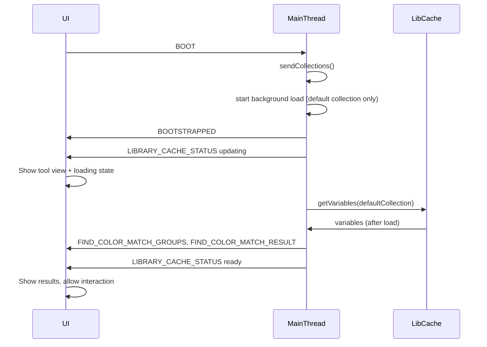

# Find Color Match: Non-blocking load and Dev Spec

## Problem summary

- **Slow first load**: Opening Find Color Match in a new project loads all variables from the Int UI Kit library. That means:
  - [cache.ts](src/app/tools/int-ui-kit-library/cache.ts) + [resolve.ts](src/app/tools/int-ui-kit-library/resolve.ts): For each **color variable** we do `importVariableByKeyAsync` + `getVariableCollectionByIdAsync` + `resolveChainForMode`. With hundreds of variables this is hundreds of async steps.
  - [main-thread.ts](src/app/tools/find-color-match/main-thread.ts) `onActivate` calls `discoverAllGroups()`, which loads variables for **every** collection (both Color palette and Semantic colors in [constants.ts](src/app/tools/int-ui-kit-library/constants.ts)), not just the selected one. So we do 2x the work (or more if more collections are added).
- **Plugin unusable during load**: In [run.ts](src/app/run.ts), `BOOT` is handled by `await activate(activeTool)`, which `await toolControllers[tool].onActivate()`. So the main thread does not send `BOOTSTRAPPED` until `onActivate()` finishes. The UI only switches to the tool view after `BOOTSTRAPPED`. So the user waits with a blank/home screen, and once the view appears, any message that triggers `loadCandidates()` (e.g. scan, hex lookup, change collection) is still processed one-at-a-time: if a load is in progress or started synchronously, that handler blocks until the load completes. So the plugin is effectively frozen during any variable load.

## Decision: Use plugin during caching + improve caching

**Recommendation: Keep caching; make loading non-blocking and load only what’s needed.**

- **Reject “always get from library”**: Without a cache, every scan/hex lookup would re-fetch all variables from the Figma API. That would make every action slow, not just the first open. Caching is the right approach.
- **Improve by**:
  1. **Non-blocking activation**: Don’t await full variable load in `onActivate`. Return quickly after sending collections (and optionally an empty/loading result) so `BOOTSTRAPPED` is sent and the tool view appears. Load the **default collection only** in the background; when done, post `FIND_COLOR_MATCH_RESULT` (and groups). User can use the UI (filters, hex input, etc.); scan results appear when the background load completes.
  2. **Load only active collection**: Stop loading variables for all collections in `discoverAllGroups()`. Load variables only for the **currently selected** collection. Populate groups for that collection from that load. When the user changes collection/mode, load that collection’s variables then (same cache path) and send groups + result. Other collections’ group lists can be filled lazily when selected or left empty until then.
  3. **Keep cache and fingerprint**: Keep the existing in-memory cache and fingerprint invalidation so subsequent opens and re-scans are fast.

This keeps the plugin responsive, reduces initial work (one collection instead of two+), and preserves cache benefits.

---

## Implementation plan

### 1. Non-blocking `onActivate` (main thread)

- In [src/app/tools/find-color-match/main-thread.ts](src/app/tools/find-color-match/main-thread.ts), change `onActivate` so it:
  - Awaits only `sendCollections()` (and ensures default collection + modes are set).
  - Does **not** await `discoverAllGroups()` or the first scan. Instead:
    - Sends an initial result (e.g. empty entries + `collectionKey`/`modeId`) and optionally a cache status like "loading" so the UI shows the tool immediately with a “Loading library…” state.
    - Kicks off a **background** async flow that: loads variables for the **default** collection only via `getVariables(..., sendCacheStatus)`, updates `groupsPerCollection` for that collection, sends `FIND_COLOR_MATCH_GROUPS`, then runs the scan and sends `FIND_COLOR_MATCH_RESULT`. On completion, sets cache status to idle/ready.
  - Returns so the main thread can send `BOOTSTRAPPED` without waiting for the load.
- Ensure `runScan`, `runHexLookup`, and message handlers that call `loadCandidates()` still work when the cache is not yet ready: they should trigger load for the active collection if needed and send results when done (they already do; the only change is that the initial load is no longer awaited in `onActivate`).

### 2. Load only active collection (remove eager `discoverAllGroups`)

- Remove the pattern that loads variables for **every** collection in `onActivate` just to populate groups. Replace with:
  - **On activate**: Only start the background load for the **default** collection (as above). Groups for that collection come from that single load.
  - **On collection/mode change** (e.g. `FIND_COLOR_MATCH_SET_COLLECTION`, `FIND_COLOR_MATCH_SET_MODE`): When the user switches collection or mode, load that collection’s variables (via existing `getVariables`/cache), update `groupsPerCollection` for that key, send `FIND_COLOR_MATCH_GROUPS`, then run scan and send result. No need to preload other collections.
- `discoverAllGroups` can be removed or refactored to “ensure groups for the active collection only” and called from the same path that loads variables for that collection (so we don’t add a separate full-scan over all collections).

### 3. UI: Loading state and status bar

- The view already has [LibraryCacheStatusBar](src/app/components/LibraryCacheStatusBar.tsx) and `LIBRARY_CACHE_STATUS`. Ensure the initial “Loading library…” (or “Checking…”) state is shown until the first `FIND_COLOR_MATCH_RESULT` (or hex result) arrives, and that the results list and hex lookup are disabled or show a loading state when cache status is `updating`/`checking` if desired. No major UI change required beyond possibly an explicit “Loading…” in the results area when entries are empty and status is not idle/ready.

### 4. Dev Spec document

- Add a **Dev Spec** for the tool so AI and developers have implementation context without re-reading the whole codebase. Per [Specs/ToDo.md](Specs/ToDo.md) (lines 26–27), the file should be named **"Find Color Match Tool. Dev Spec.md"** and live under `Specs/tools/`.
- Suggested sections (concise, for implementation and debugging):
  - **Purpose**: One sentence (match unbound colors to Int UI Kit variables; apply variable).
  - **Entry points**: `registerFindColorMatchTool` in [main-thread.ts](src/app/tools/find-color-match/main-thread.ts), view [FindColorMatchToolView.tsx](src/app/views/find-color-match-tool/FindColorMatchToolView.tsx), messages (UI_TO_MAIN/MAIN_TO_UI for Find Color Match and LIBRARY_CACHE_STATUS).
  - **Data flow**: Main thread holds `collectionSources`, `activeCollectionKey`, `activeModeId`, `groupsPerCollection`; uses [int-ui-kit-library/cache.ts](src/app/tools/int-ui-kit-library/cache.ts) and [resolve.ts](src/app/tools/int-ui-kit-library/resolve.ts) for variables; scan → match → result entries; apply via [apply.ts](src/app/tools/find-color-match/apply.ts).
  - **Library/cache**: Collections from `getCachedCollections()`; variables per collection+mode via `getVariables()` (fingerprint cache); `getCachedVariablesSync()` for instant path when cache is warm. Loading is non-blocking after the change above.
  - **Key files**: main-thread, scan, match, apply, variables, types; int-ui-kit-library (constants, cache, resolve); view, LibraryCacheStatusBar; messages (Find Color Match + LibraryCacheStatus payloads).
  - **Behaviours**: Selection change → debounced runScan; collection/mode/group change → load that collection if needed, then runScan; hex lookup uses same cache; Apply sends variable to node and notifies.
  - **Testing**: Reference [src/test-fixtures/find-color-match.ts](src/test-fixtures/find-color-match.ts) and any scenarios in tool-registry for the tool.

---

## Flow after change (high level)

---

## Risks and mitigations

- **Race conditions**: If the user changes collection before the initial load finishes, the background load should complete and send result for the *then*-active collection, or we cancel/ignore stale results (e.g. by comparing `activeCollectionKey`/`activeModeId` when posting result). Prefer comparing current active collection/mode before sending result and only send if still matching.
- **Existing functionality**: Scan, hex lookup, Apply, focus node, and group/collection/mode switches all continue to use `loadCandidates()` or cached data; they just don’t block activation. No change to apply logic or match algorithm.

---

## Files to touch

| Area                        | File                                                                                                                             |
| --------------------------- | -------------------------------------------------------------------------------------------------------------------------------- |
| Activation + load           | [src/app/tools/find-color-match/main-thread.ts](src/app/tools/find-color-match/main-thread.ts)                                   |
| UI loading state (optional) | [src/app/views/find-color-match-tool/FindColorMatchToolView.tsx](src/app/views/find-color-match-tool/FindColorMatchToolView.tsx) |
| New doc                     | `Specs/tools/Find Color Match Tool. Dev Spec.md`                                                                                 |

No changes to cache.ts or resolve.ts API are required; only how and when the main thread calls them.