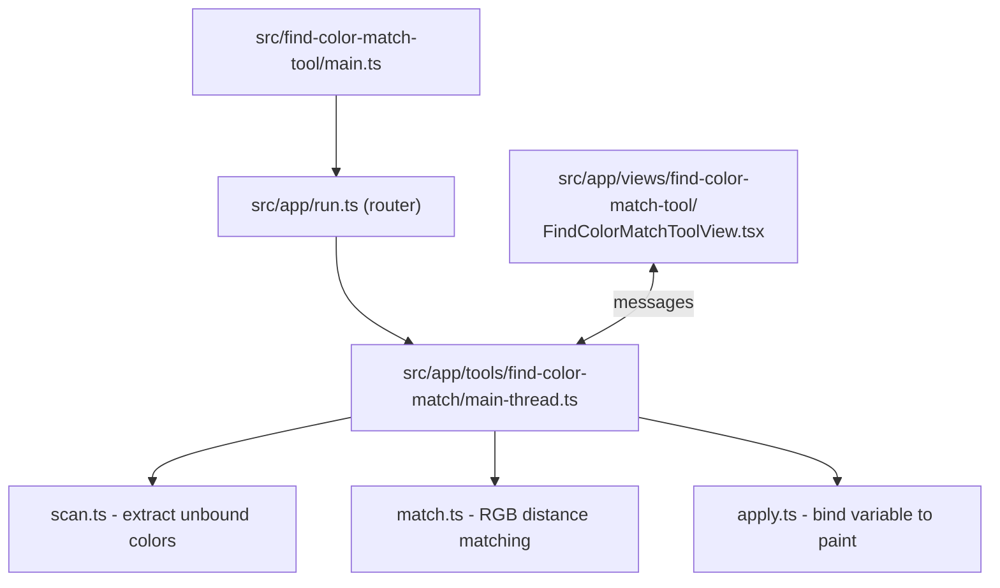
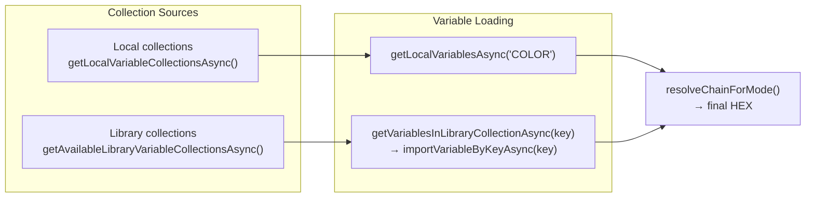

---

name: Find Color Match Tool
overview: "Add a new Find Color Match tool that scans the selection for unbound solid colors, matches them against color variables from the Int UI Kit: Islands library (filtered by collection and mode), and lets the user apply a variable binding per color row."
todos:

- id: extract-color-utils
content: Export colorToRgbHex / colorToOpacityPercent from variable-chain.ts (or extract to shared color-utils) so scan.ts and match.ts can reuse them
status: completed
- id: create-types
content: Create src/app/tools/find-color-match/types.ts with FoundColor, VariableCandidate, MatchResult, and other shared types
status: completed
- id: create-scan
content: Create src/app/tools/find-color-match/scan.ts — recursive selection scanner that extracts unbound SOLID colors (fills, strokes, text fills) with skip rules
status: completed
- id: create-variables
content: Create src/app/tools/find-color-match/variables.ts — load variable candidates from local collections AND library collections (team library API with importVariableByKeyAsync), resolve to HEX per mode, with progress callback
status: completed
- id: create-match
content: Create src/app/tools/find-color-match/match.ts — RGB Euclidean distance calculation, best-match sorting, diff % computation
status: completed
- id: create-apply
content: Create src/app/tools/find-color-match/apply.ts — bind a chosen variable to a specific paint on a specific node
status: completed
- id: add-messages
content: Add FIND_COLOR_MATCH_* message constants and payload types to src/app/messages.ts
status: completed
- id: create-main-thread
content: Create src/app/tools/find-color-match/main-thread.ts — registerFindColorMatchTool with scan, match, apply handlers + selection change listener
status: completed
- id: create-entry
content: Create src/find-color-match-tool/main.ts entry point
status: completed
- id: create-view
content: Create src/app/views/find-color-match-tool/FindColorMatchToolView.tsx — UI with collection/mode dropdowns, results list with per-row Apply
status: completed
- id: wire-routing
content: Update run.ts, ui.tsx, HomeView.tsx, package.json to register the new tool
status: completed
- id: build-verify
content: Run npm run build and fix any lint/type errors
status: completed
isProject: false

---

# Find Color Match Tool

## Assessment

**Is this a good idea?** Yes. The existing toolset can inspect color chains and replace variable usages, but has no way to suggest which variable best matches a raw/unbound color. This fills a clear gap for migration workflows.

**Will it break existing functionality?** No. This is a purely additive new tool -- new files, new message types, new menu entry. Existing tools are untouched.

**How does the main user flow change?** A new tool card appears on the Home screen. Users select layers with raw colors, open the tool, see suggested variable matches per color, and apply them individually.

## Architecture

Follows the established tool pattern:




## Data Flow

1. **On open**: Main thread discovers collections from the **"Int UI Kit: Islands"** library via `getAvailableLibraryVariableCollectionsAsync()` (filtered by `libraryName === "Int UI Kit: Islands"`). Sends collection list + modes to UI for the filter dropdowns. Also includes local collections as fallback options.
2. **On selection change** (debounced): Main thread scans selection recursively, extracts unbound SOLID colors (fills, strokes, text fills)
3. **Variable loading**: For the selected collection:
  - **Library collection** (primary): `getVariablesInLibraryCollectionAsync(collectionKey)` to list variables, then `importVariableByKeyAsync(key)` for each COLOR variable to make them resolvable (with progress feedback -- could be slow for large libraries)
  - **Local collection** (fallback): `getLocalVariablesAsync("COLOR")` filtered by collection ID
4. **Variable resolution**: For each loaded variable, resolve to final HEX for the selected mode via alias chains (reuses existing `variable-chain.ts` logic). Cache results.
5. **Matching**: Computes RGB Euclidean distance between each found color and each variable's resolved HEX. Picks the closest match per found color
6. **UI render**: Shows a list of found colors with their best match, diff %, and a variable selector + Apply button per row
7. **Per-row Apply**: Binds the chosen variable to that specific paint on the node

## Variable Source Architecture (local + library)

The plugin already has `"permissions": ["teamlibrary"]`. The existing pattern from `[src/app/tools/mockup-markup/resolve.ts](src/app/tools/mockup-markup/resolve.ts)` shows how to access library variables:




**Target library: "Int UI Kit: Islands"**

The tool defaults to collections from the `"Int UI Kit: Islands"` library (stored as a constant, similar to `MOCKUP_MARKUP_LIBRARY_NAME` in `presets.ts`). On open, it filters `getAvailableLibraryVariableCollectionsAsync()` results by `libraryName === "Int UI Kit: Islands"` and auto-selects the first matching collection.

Local collections are also listed in the dropdown as fallback options (labeled differently).

**Key considerations for library variables:**

- `getVariablesInLibraryCollectionAsync(key)` returns `LibraryVariable[]` (name, key, resolvedType) -- lightweight descriptors, no actual values
- To resolve a library variable's HEX, we must first **import** it via `importVariableByKeyAsync(key)`, which returns a full `Variable` object
- For Int UI Kit (potentially hundreds of color variables), this batch import should show progress ("Loading variables... 42/180")
- Once imported, variables are cached and fast to resolve on subsequent scans
- If the library is not enabled in the file, show a helpful message: "Enable the Int UI Kit: Islands library in Assets → Libraries"

## Color Scanning Logic (from original plugin)

Scan selection recursively. For each node, extract SOLID paints from fills, strokes, and text fills. **Skip**:

- Hidden layers (`visible === false`)
- Hidden fills/strokes (`paint.visible === false`)
- Colors already bound to a variable (`paint.boundVariables?.color`)
- Colors already bound to a paint style (node has `fillStyleId`/`strokeStyleId`)
- Children inside Union/Subtract boolean operations

Each found color records: `hex`, `r`, `g`, `b`, `opacity`, `nodeId`, `nodeName`, `colorType` (FILL/STROKE/TEXT), and paint index for precise Apply targeting.

## Matching Algorithm

Simple RGB Euclidean distance (no semantic scoring in simplified version):

```typescript
function colorDistance(c1: RGB, c2: RGB): number {
  const dr = (c1.r - c2.r) * 255
  const dg = (c1.g - c2.g) * 255
  const db = (c1.b - c2.b) * 255
  return Math.sqrt(dr * dr + dg * dg + db * db)
}
// Diff % = (distance / sqrt(255^2 + 255^2 + 255^2)) * 100
```

## UI Layout

Following Design Principles (single scroll, consistent spacing, auto-refresh for small utilities):

- **ToolHeader**: "Find Color Match" + back button
- **Filters row**: Collection dropdown + Mode dropdown (from `@create-figma-plugin/ui` `Dropdown` component)
- **Results list** (scrollable via ToolBody):
  - Per color row: ColorSwatch | Node name + color type | HEX | Diff % | Variable dropdown | Apply button
  - Group by unique color HEX (one color can appear on multiple nodes)
  - After Apply, row shows "Applied" state or is removed
- **Empty states**: "No selection" / "No unbound colors found" using shared `State` component

Auto-refresh on selection change (debounced), per design principles for small utilities.

## Files to Create


| File                                                               | Purpose                                                                        |
| ------------------------------------------------------------------ | ------------------------------------------------------------------------------ |
| [`src/find-color-match-tool/main.ts`]                              | Tool entry point (same pattern as other tools)                                 |
| [`src/app/tools/find-color-match/main-thread.ts`]                  | Main thread: scan, match, apply, selection change handler                      |
| [`src/app/tools/find-color-match/scan.ts`]                         | Extract unbound SOLID colors from selection recursively                        |
| [`src/app/tools/find-color-match/match.ts`]                        | RGB distance calculation + best-match sorting                                  |
| [`src/app/tools/find-color-match/apply.ts`]                        | Bind a variable to a specific paint on a node                                  |
| [`src/app/tools/find-color-match/variables.ts`]                    | Load variables from local collections + library collections (team library API) |
| [`src/app/tools/find-color-match/types.ts`]                        | Shared types (FoundColor, VariableCandidate, MatchResult)                      |
| [`src/app/views/find-color-match-tool/FindColorMatchToolView.tsx`] | UI view with filters, results list, per-row Apply                              |


## Files to Modify


| File                                                                 | Changes                                                        |
| -------------------------------------------------------------------- | -------------------------------------------------------------- |
| `[src/app/messages.ts](src/app/messages.ts)`                         | Add `FIND_COLOR_MATCH_*` message constants + payload types     |
| `[src/app/run.ts](src/app/run.ts)`                                   | Register `findColorMatch` tool, add to `toolCommands`, routing |
| `[src/app/ui.tsx](src/app/ui.tsx)`                                   | Add `"find-color-match-tool"` route + import view              |
| `[src/app/views/home/HomeView.tsx](src/app/views/home/HomeView.tsx)` | Add ToolCard in the "General" section                          |
| `[package.json](package.json)`                                       | Add menu entry for "Find Color Match"                          |


## Existing Code to Reuse

- `**[src/app/variable-chain.ts](src/app/variable-chain.ts)`**: `resolveChainForMode` for alias chain resolution to final HEX. Will need to export `colorToRgbHex` and `colorToOpacityPercent` (currently private)
- `**[src/app/tools/variables-shared/caching.ts](src/app/tools/variables-shared/caching.ts)**`: `getLocalVariablesForType("COLOR")`, `getAllCollections()`, `getCollection()`
- `**[src/app/tools/mockup-markup/resolve.ts](src/app/tools/mockup-markup/resolve.ts)**`: Pattern for `getAvailableLibraryVariableCollectionsAsync()` + `getVariablesInLibraryCollectionAsync()` + `importVariableByKeyAsync()` -- proven library variable access flow
- **Shared components**: `ColorSwatch`, `ToolHeader`, `ToolBody`, `State`, `DataTable`
- **UI library**: `Dropdown`, `IconButton` from `@create-figma-plugin/ui`

## Message Types (new)

- **UI to Main**: `FIND_COLOR_MATCH_SCAN` (trigger scan), `FIND_COLOR_MATCH_APPLY` (apply one match), `FIND_COLOR_MATCH_FOCUS_NODE` (focus layer on canvas)
- **Main to UI**: `FIND_COLOR_MATCH_RESULT` (scan results + matches), `FIND_COLOR_MATCH_COLLECTIONS` (available collections + modes), `FIND_COLOR_MATCH_APPLY_RESULT` (success/error per row)

## Key Decisions

- **Per-row Apply** (not global batch) per user preference -- each color row gets its own Apply button
- **Auto-refresh** on selection change (debounced ~200ms) -- aligns with Design Principles for small utilities
- **Target library**: "Int UI Kit: Islands" -- auto-selected on open. Collection dropdown also includes local collections as fallback. Mode dropdown shows modes from the selected collection.
- **Collection + Mode filters** populated from library collections (via team library API) + local collections. Library collections require importing variables before resolving HEX (with progress feedback)
- **No YAML mappings, no semantic scoring, no import/export** -- simplified from original
- **No "Update selection" button** -- auto-refresh handles it

