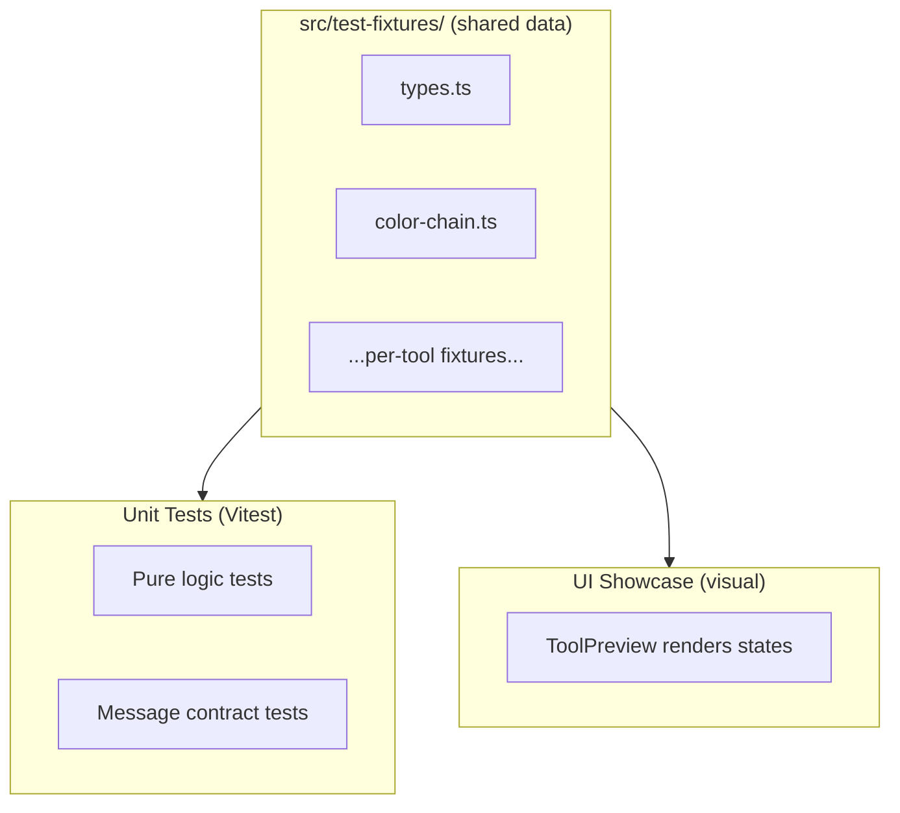

# Testing Strategy for Paid Plugin

## Why This Matters

9 tools share logic through these high-risk modules (ordered by blast radius):

1. **[messages.ts](src/app/messages.ts)** -- 82+ message types, every tool depends on it
2. **[variable-chain.ts](src/app/variable-chain.ts)** -- color resolution logic, used by Color Chain + Find Color Match
3. **[variables-shared/](src/app/tools/variables-shared/)** -- caching, node traversal, JSON parsers (4 tools)
4. **[print-color-usages/shared.ts](src/app/tools/print-color-usages/shared.ts)** -- color utilities
5. **Shared UI components** (Page, ToolHeader, ScopeControl, DataTable) -- 20 components, all tools

A bug in any of these cascades to multiple tools. TypeScript catches type-level drift but not logic regressions.

## Current State

- 1 test file (`tests/print-color-usages-shared.test.cjs`) using Node.js built-in test runner
- Hacky pipeline: `tsc` compiles a single file to CJS, then `node --test` runs it
- Test fixtures: 1 file (`tests/fixtures/figma-fakes.cjs`)
- No Vitest, no watch mode, no coverage

## Approach: Two Testing Layers

### Layer 1: Unit Tests for Pure Logic (~30% of codebase)

Functions that have **zero Figma API calls** -- pure input/output:


| Module                             | Testable Functions                                                                                                                                                    |
| ---------------------------------- | --------------------------------------------------------------------------------------------------------------------------------------------------------------------- |
| `variable-chain.ts`                | `toByteHex`, `clamp01`, `colorToRgbHex`, `colorToOpacityPercent`, `isColorValue`                                                                                      |
| `variables-shared/json-parsers.ts` | `parseImportedRenamePlan`, `parseSnapshotDoc`, `flattenSnapshotVariablesTree`, `flattenSnapshotDoc`, `parseUsagesReplaceMappingJson`, `snapshotTypeToResolvedType`    |
| `variables-shared/node-utils.ts`   | `solidPaintToHex`, `getVariableNameSuffix`, `getVariableGroupName`, `nodeNameStartsWithVariableId`, type guards (`hasChildren`, `hasFills`, etc.)                     |
| `print-color-usages/shared.ts`     | `maybeStripFolderPrefix`, `rgbToHex`, `stripTrailingModeSuffix`, `extractModeNameFromLayerName`, `extractVariableIdFromLayerName`, `getBoundColorVariableIdFromPaint` |
| `utils/component-name.ts`          | `stripVariantInfo`                                                                                                                                                    |
| `library-swap/mapping-types.ts`    | Mapping merge/lookup functions                                                                                                                                        |


### Layer 2: Message Contract Tests (regression safety)

Test that tool views handle expected message shapes correctly by:

- Dispatching `MainToUiMessage` payloads (same fixtures used in showcase)
- Verifying the view renders without crashing
- Verifying expected UI state (loading indicator, result count, error text)

This catches: "I renamed a field in `messages.ts` and broke 3 tool views."

Uses the **same `Scenario` fixtures** from `src/test-fixtures/` that the showcase uses -- no duplication.




## Implementation

### Step 1: Set up Vitest

- Install `vitest` + `@testing-library/preact` (for contract tests)
- Create `vitest.config.ts` with aliases matching the existing `tsconfig.json`
- Configure Figma plugin typings as globals (so type guards compile)
- Update `package.json` scripts: replace hacky `test` script with `vitest run`
- Remove `.tmp-tests/` pipeline

### Step 2: Migrate existing tests

- Convert `tests/print-color-usages-shared.test.cjs` to `src/app/tools/print-color-usages/shared.test.ts`
- Convert `tests/fixtures/figma-fakes.cjs` to `src/test-fixtures/figma-fakes.ts`
- Tests live **next to the code they test** (co-located pattern, e.g. `shared.test.ts` beside `shared.ts`)

### Step 3: Add unit tests for shared pure logic

Priority order (by blast radius):

1. `variable-chain.ts` -- color math functions
2. `variables-shared/json-parsers.ts` -- all 3 parsers + flattener
3. `variables-shared/node-utils.ts` -- type guards + string helpers
4. `print-color-usages/shared.ts` -- already has tests, just migrate
5. `utils/component-name.ts`
6. `library-swap/mapping-types.ts`

### Step 4: Add message contract smoke tests

For each tool, one test file that:

- Imports the real view component
- Dispatches each scenario's messages via `mock-message-bus.ts`
- Asserts: no crash, expected DOM elements present

This is the **same** data flow as the showcase but automated.

### Step 5: CI guard

- Add `npm test` to a pre-commit hook or CI workflow
- Tests must pass before build

## File Structure After

```
src/
  app/
    variable-chain.ts
    variable-chain.test.ts          <-- co-located
    tools/
      variables-shared/
        json-parsers.ts
        json-parsers.test.ts        <-- co-located
        node-utils.ts
        node-utils.test.ts          <-- co-located
      print-color-usages/
        shared.ts
        shared.test.ts              <-- migrated from tests/
      library-swap/
        mapping-types.ts
        mapping-types.test.ts       <-- co-located
    utils/
      component-name.ts
      component-name.test.ts        <-- co-located
  test-fixtures/
    types.ts                        <-- shared Scenario type (exists)
    figma-fakes.ts                  <-- migrated from tests/fixtures/
    color-chain.ts                  <-- shared with showcase
    ...per-tool fixtures...
vitest.config.ts                    <-- new
```

The old `tests/` directory gets deleted after migration.

## What This Does NOT Cover (and why)

- **Figma API-dependent logic** (e.g., `resolveChainForMode`, `collectNodesForScope`): These need either a "Ports & Adapters" refactor or real Figma environment. Not worth the effort right now -- manual testing in Figma + the showcase covers these visually.
- **Visual regression** (screenshot diffing): Overkill for current scale. The showcase gives you visual regression checking "by eye."
- **E2E in Figma**: No reliable headless Figma environment exists. Manual checklist remains the strategy for full integration flows.

## Effort Estimate

- Step 1 (Vitest setup): ~30 min
- Step 2 (migrate existing tests): ~15 min
- Step 3 (pure logic tests): ~2-3 hours across 6 modules
- Step 4 (message contract tests): ~1 hour per tool (can be incremental)
- Step 5 (CI guard): ~15 min

