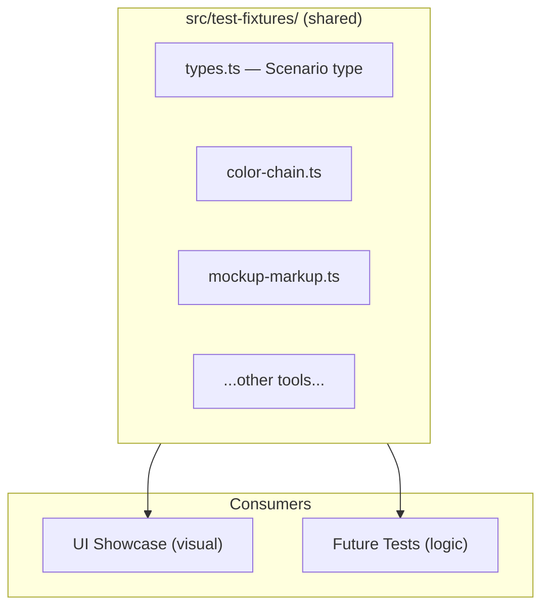
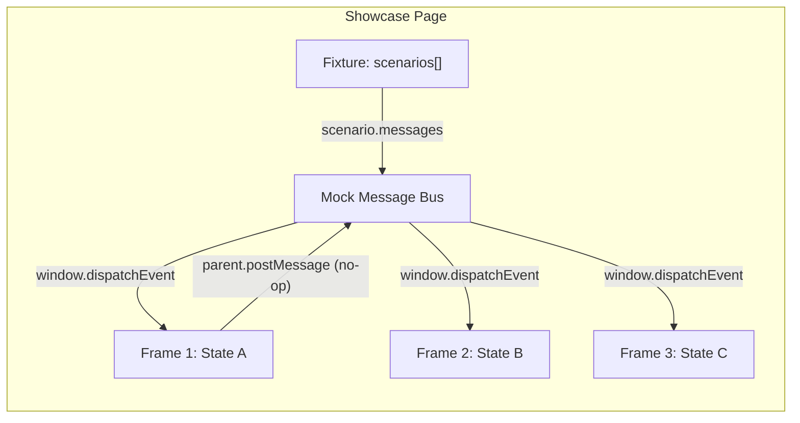

# Live Tool Previews in UI Showcase

## Core Idea: Shared Test Fixtures

Fake data lives in `src/test-fixtures/` -- one file per tool, plus a shared types file. Each fixture defines a **scenario**: a name, a label, and an array of `MainToUiMessage` payloads that put the tool into a specific state.




**Why shared:**

- Same realistic data for visual checks AND automated tests
- One place to add a new edge case (e.g. "10 colors in selection") -- it appears in both showcase and tests
- Typed against `MainToUiMessage` from [src/app/messages.ts](src/app/messages.ts) -- TypeScript catches drift at compile time

## Architecture

All tool views communicate with the Figma main thread exclusively via `parent.postMessage` (outgoing) and `window.addEventListener("message")` (incoming). None import `figma.`* directly. The showcase renders the **real view components** and simulates states by dispatching mock messages.




## New Files

### 1. `src/test-fixtures/types.ts`

```typescript
import type { MainToUiMessage } from "../app/messages"

export type Scenario = {
  id: string
  label: string
  messages: MainToUiMessage[]
}
```

### 2. `src/test-fixtures/<tool-name>.ts` (one per tool)

Each file exports `scenarios: Scenario[]`. Example for Color Chain:

```typescript
export const scenarios: Scenario[] = [
  {
    id: "empty-selection",
    label: "Empty Selection",
    messages: [{ type: "SELECTION_EMPTY" }],
  },
  {
    id: "single-layer",
    label: "Single Layer with Chain",
    messages: [{
      type: "VARIABLE_CHAINS_RESULT_V2",
      results: [{ layerId: "1:2", layerName: "Button", layerType: "RECTANGLE",
        colors: [{
          variableId: "v1", variableName: "button/primary",
          collectionName: "Int UI Kit",
          appliedMode: { status: "single", modeId: "m1", modeName: "Light" },
          chainToRender: {
            modeId: "m1", modeName: "Light",
            chain: ["button/primary", "blue/500"],
            finalHex: "#0086FF", finalOpacityPercent: 100, circular: false,
          },
          hasOtherModes: true,
        }],
      }],
    }],
  },
  {
    id: "error",
    label: "Error",
    messages: [{ type: "ERROR", message: "Failed to inspect selection" }],
  },
]
```

**Key:** the data is realistic (real variable names, real hex colors from the design system) so the showcase looks like the actual plugin.

### 3. `src/preview/mock-message-bus.ts`

- `**dispatch(msg)`** — wraps in `{ data: { pluginMessage: msg } }`, dispatches as `MessageEvent`
- `**patchParentPostMessage()`** — replaces with no-op logger
- `**dispatchSequence(msgs, delayMs)`** — dispatches with delays (for loading-then-results flows)

### 4. `src/preview/ToolPreview.tsx`

Renders **all scenarios side by side** as independent 360x500 frames:

```
┌─────────────────────────────────────────────────────────────────────┐
│  View Colors Chain                                                  │
│                                                                     │
│  ┌─────────────┐  ┌─────────────┐  ┌─────────────┐  ┌───────────┐ │
│  │ Empty        │  │ Single      │  │ Multi-layer │  │ Error     │ │
│  │ Selection    │  │ Layer       │  │ Results     │  │           │ │
│  │              │  │             │  │             │  │           │ │
│  │  360×500     │  │  360×500    │  │  360×500    │  │  360×500  │ │
│  │              │  │             │  │             │  │           │ │
│  └─────────────┘  └─────────────┘  └─────────────┘  └───────────┘ │
└─────────────────────────────────────────────────────────────────────┘
```

Each frame: independent view mount with unique `key` + its own message sequence dispatched after mount.

### 5. Updated `src/preview/preview-app.tsx`

Navigation sidebar:

- **Components** — existing showcase
- **Home** — home page preview
- **Tools** — each tool as a separate page showing all states side by side

## Fixtures Per Tool

- **Color Chain** — empty selection, single layer chain, multi-layer (3+ layers), circular chain, error
- **Mockup Markup** — nothing selected, text node selected, working (applying)
- **Find Color Match** — empty selection, no unbound colors, results with matches (1 color, 5+ colors), hex lookup results
- **Library Swap** — no mapping, analyze results, apply results with swapped items
- **Print Color Usages** — print tab idle, print preview entries, update tab with diff preview
- **Export / Import** — collections list, export ready (download), import preview with creates/updates
- **Rename via JSON** — collections list, import preview with renames + conflicts + stale entries
- **Create Linked Colors** — empty selection, variable selected with matches, success message
- **Replace Usages** — idle, preview with mapping rows + invalid rows, apply progress

## Why This Works

- **Real components** — no duplication, always in sync
- **Typed fixtures** — `MainToUiMessage` type ensures compile-time safety
- **Shared data** — same fixtures feed showcase and future Vitest tests
- **Easy to extend** — adding a new edge case = adding one object to the scenarios array
- **Realistic** — fixture data uses real variable names, collection names, hex colors from the design system

## Implementation Order

1. Mock message bus + fixture types + ToolPreview wrapper
2. Color Chain fixtures + tool page (validate the pattern)
3. Mockup Markup fixtures + tool page
4. Navigation rework
5. Remaining 7 tools one by one

